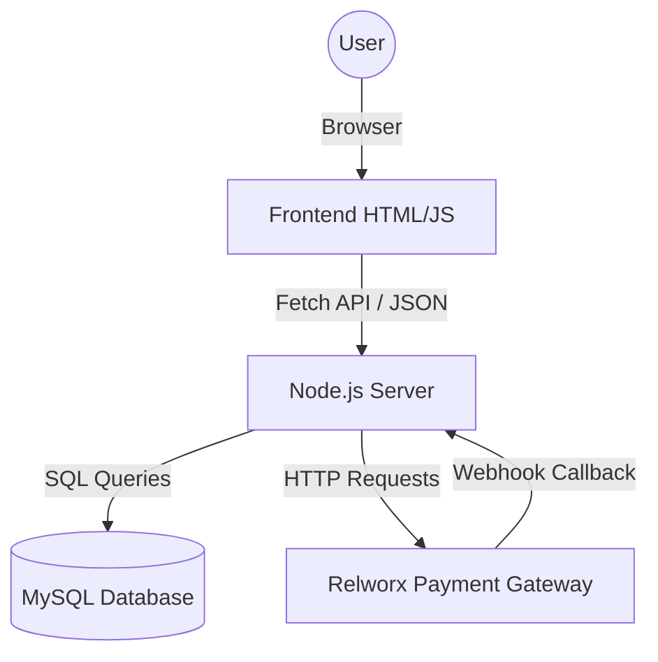

# WiPay Codebase Master Guide

This document explains **how WiPay works from scratch**. It is designed to help you verify, debug, and extend every part of the system.

## 1. High-Level Architecture

WiPay is a **Client-Server Application**.

*   **Frontend (Client)**: Built with **Vanilla HTML/CSS/JS**. No complex frameworks (like React/Vue). It runs in the user's browser.
    *   *Role*: Displays the UI, handles clicks, and calls the Server API.
*   **Backend (Server)**: Built with **Node.js (Express)**. Rests on your computer (or cloud server).
    *   *Role*: Processes rules, talks to the Database, and talks to External APIs (Relworx).
*   **Database**: **MySQL**.
    *   *Role*: Stores users, vouchers, transaction history, and wallet balances.



---

## 2. Directory Structure

This is where everything lives.

```text
WIPAY/
├── client/                  # [FRONTEND] All the visible parts
│   ├── dashboard.html       # The MAIN APP (Admin Panel)
│   ├── index.html           # Landing Page
│   ├── login.html           # Login Page
│   ├── css/                 # Stylesheets
│   └── js/                  # Frontend Scripts
│       └── config.js        # Global settings (API URL)
│
├── server/                  # [BACKEND] The Brain
│   ├── server.js            # *** ENTRY POINT *** (Start here!)
│   ├── .env                 # Secrets (Passwords, API Keys) - KEEP SAFE
│   ├── src/
│   │   ├── config/          # Configurations
│   │   │   └── db.js        # Database Connection Setup
│   │   ├── middleware/      # Security Guards
│   │   │   └── authMiddleware.js # Checks "Are you logged in?"
│   │   └── routes/          # API Instructions (The "Menu")
│   │       ├── authRoutes.js    # Login/Register
│   │       ├── adminRoutes.js   # Main Business Logic (Vouchers, Stats)
│   │       └── paymentRoutes.js # Relworx Integration
│   └── scripts/             # Helper Tools (DB Setup, Maintenance)
```

---

## 3. The Backend (Server)

### 3.1 The Entry Point: `server.js`
This file is the **Captain**. When you run `node server.js`, this happens:
1.  **Setup**: Loads libraries (`express`, `mysql`, `cors`).
2.  **Security**: Sets up Rate Limiting (prevents spam) and CORS (allows browser access).
3.  **Routes**: It says, *"If a request comes to `/api/auth`, send it to `authRoutes.js`"*.
4.  **Listen**: It opens Port **5002** and waits for commands.

### 3.2 The Database (MySQL)
Your data is organized into **Tables**. Use `server/scripts/setup_multitenancy.js` to see the definitions.

*   `admins`: The users who can log in. (Columns: `id`, `username`, `password_hash`).
*   `vouchers`: The Wi-Fi access codes you sell. (Columns: `code`, `status`, `admin_id`).
*   `transactions`: History of money moving.
*   `sms_fees`: Your wallet for buying/spending SMS credits. **Crucial for your balance**.

### 3.3 The Routes (The Logic)
Routes are functions that run when the Frontend asks for something.

*   **`authRoutes.js`**:
    *   `POST /login`: Receives username/password. Checks DB. If match, signs a **JWT Token** (a digital ID card) and sends it back.
*   **`adminRoutes.js`** (The Heavy Lifter):
    *   `POST /sell-voucher`:
        1. Checks your SMS Balance. (If too low, stops).
        2. Picks an unused voucher from DB.
        3. Sends SMS to the customer.
        4. Deducts cost from your `sms_fees` balance.
    *   `GET /stats`: counts your money/sales.
*   **`paymentRoutes.js`**:
    *   `POST /webhook`: The "Listener". Relworx sends data here when a payment succeeds. It updates your DB automatically.

---

## 4. The Frontend (Client)

### 4.1 `dashboard.html` (The Monolith)
This single file contains **Use Views** and **Logic**.
*   **HTML**: It has many `<section>` tags (e.g., `<section id="dashboard-view">`, `<section id="payments-view">`).
*   **CSS**: Typically `display: none`. Only *one* section is shown at a time.
*   **Navigation**: When you click "Payments" in the sidebar, a JS function hides "Dashboard" and shows "Payments".

### 4.2 `fetchAuth()` Helper
You will see this function everywhere.
*   It's a wrapper around the standard `fetch()`.
*   **Job**: Automatically attaches your **JWT Token** to every request.
*   *"Server, give me stats."* -> *fetchAuth adds "Authorization: Bearer xyz123"* -> *Server says "Okay, I know who you are."*

---

## 5. Key Workflows (How It All Connects)

### Scenario A: Selling a Voucher
1.  **User** clicks "Sell" in `dashboard.html`.
2.  **Frontend** calls `POST /api/admin/sell-voucher` with `{ phone, package }`.
3.  **Server** (`adminRoutes.js`) receives it.
    *   *Auth Middleware* checks token. "User is Admin ID 5".
    *   *Code* checks `sms_fees` table. "Balance > 35?" -> Yes.
    *   *Code* updates `vouchers` table: Marks voucher as "sold".
    *   *Code* calls SMS Gateway to text the code.
    *   *Code* inserts `-35` into `sms_fees` (Deduct cost).
4.  **Server** responds `200 OK`.
5.  **Frontend** shows "Success" popup.

### Scenario B: Buying SMS Credits (The Payment Flow)
1.  **User** enters phone & amount in "Buy SMS" modal.
2.  **Frontend** calls `POST /api/admin/buy-sms`.
3.  **Server** calls Relworx API to generate a request.
4.  **Frontend** enters **Polling Mode**:
    *   Every 2 seconds, it calls `GET /api/admin/sms-status/:ref`.
5.  **Server** (`adminRoutes.js`):
    *   Checks DB. (Is it success yet? No.)
    *   Calls Relworx API: "Is this paid?"
    *   If Relworx says "YES": Updates DB to 'success'. Returns 'success'.
6.  **Frontend** sees 'success'. Stops polling. Shows "Thank you!".
7.  **Auto-Refresh**: 10s later, the dashboard reloads. Balance calculation (`SUM(sms_fees)`) now includes the new money.

---
**Ready to explore?**
Open `server/server.js` to see the starting line, or `client/dashboard.html` to see the UI logic.
